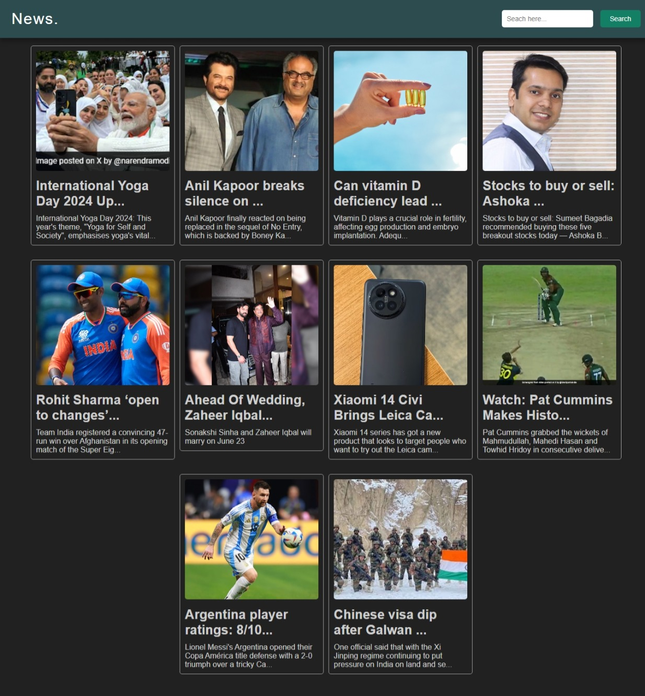

# JsNewsApp 📰

Welcome to the JsNewsApp! This is a simple news app built using HTML, CSS, and JavaScript. It allows you to fetch and display news articles from the News API. 🚀

**Here are the key features:**

- 🖥️ **Fetches random news:** Retrieves top headlines from India (you can customize this).
- 🔍 **Searches for specific news:** Allows users to search for news articles related to a given query.
- 🖼️ **Displays news articles with images:** Each news article is presented with its title, description, and a corresponding image.
- 🔗 **Links to the full article:**  Clicking on an article takes you to its full version on the original news website.
- ✨ **Responsive design:**  The app adapts to different screen sizes, ensuring a smooth user experience on desktops, tablets, and mobile devices.

**Here's a sneak peek:**




**Want to learn how to build this app?**  Check out my YouTube tutorial:

[**YouTube Tutorial Link**](https://youtu.be/ZGLKTQVyT0U?si=vk6RwVIKQfXTn1a8)

**Try out the live demo:**

[**GitHub Pages Demo Link**](https://gupta-ravi.github.io/JsNewsApp)

**Let's get started!**

1. **Clone the repository:**
```bash
git clone https://github.com/Gupta-Ravi/JsNewsApp
```

2. Open index.html in your browser.

**To use the app:**

- **Browse random news:** The app loads a set of random news articles upon initial launch.
- **Search for news:** Enter a keyword or phrase in the search bar and click "Search" to find relevant articles.

**Customization:**

- **Change the news source:** Update the `country` parameter in `app.js` to fetch news from a different country.
- **Modify the styling:** Customize the appearance of the app by adjusting the CSS in `style.css`.

**Contributing:**

Feel free to fork the repository and contribute improvements or new features! 🤝

**Let me know if you have any questions!** 😄